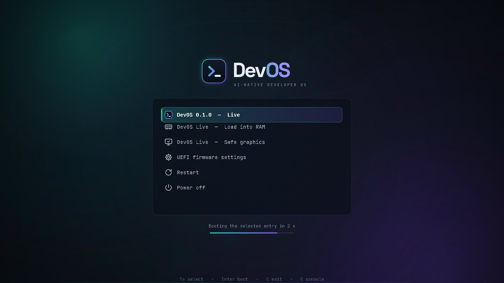

# DevOS Documentation
# ===================

## Overview
DevOS documentation index.

## Documents
- [SRS.md](../SRS.md) — Software Requirements Specification
- [ROADMAP.md](../ROADMAP.md) — Project Roadmap
- [CONTRIBUTING.md](../CONTRIBUTING.md) — Contributing Guide
- [README.md](../README.md) — Project Overview

## DevOS AI
- [Overview and code map](../ai/README.md)
- [IPC protocol](ipc.md)
- [Security controls and known gaps](security.md)
- [ADR 0001: agent runtime](adr/0001-agent-runtime.md)

## Desktop
- [DevOS shell: AI panel, status, Welcome](../desktop/devos-shell)
- [Keybindings](keybindings.md)
- [Enabled services](services.md)

## Developer
- [Profiles](../developer/profiles) (package lists, validated by `scripts/check-packages.sh`)

## Boot (GRUB)


- Theme sources: [boot/grub/src](../boot/grub/src), layout: [boot/grub/theme.txt](../boot/grub/theme.txt)
- Rendered theme (committed): [boot/grub/themes/devos](../boot/grub/themes/devos)
- Live menu: [iso/grub/grub.cfg](../iso/grub/grub.cfg); installed-system defaults: [boot/grub/default-grub](../boot/grub/default-grub)

Workflow after changing artwork or layout:

```bash
scripts/render-grub-theme.sh                       # regenerate assets
scripts/preview-grub-theme.sh -m 1920x1080         # screenshot -> dist/grub-preview.png
scripts/preview-grub-theme.sh -m 1280x720          # check the smallest supported layout
scripts/preview-grub-theme.sh -i                   # interactive QEMU window
```

## Build
- [Building and testing](building.md)
- [Build Script](../scripts/build-iso.sh) — `sudo scripts/build-iso.sh` → `dist/devos-<VERSION>-x86_64.iso`
- [Package check](../scripts/check-packages.sh) — validates package lists against official repos

## License
License information will be finalized before the first public release.
